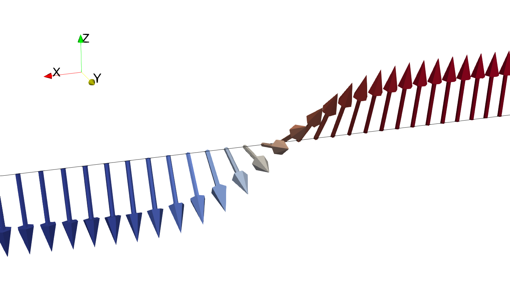

# Общая Информация
## Структура репозитория:
- папка notebooks содержит пример рабочего ноутбука, использовавшегося для обучения нейронной сети и минимизации энергии;
- папка examples содержит десять примеров инициализации моделей и их работы;
- папка pics содержит иллюстрации, в частности графики функций потерь и погрешностей по эпохам обучения.

## Необходимые для работы библиотеки:
Для воспроизведения результатов нужно использовать библиотеки jaxopt (использовалась версия 0.8.3) и jax. D В случае Google Collab библиотека jax предустановлена и из коробки работает с видеокартой. В случае Yandex DataSphere библиотека также предустановлена, но для работы с видеокартой нужно установить ее отдельно (см. https://jax.readthedocs.io/en/latest/installation.html и notebooks/JAX_bloch_wall_nn.ipynb). 

## Теоретический базис
В задачах микромагнетизма при минимизации энергии возникают проблемы с необходимостью задавать подробную вычислительную сетку. Один из способов избежать слишком большого количества степеней свободы - машинное обучение, а именно обучение искусственной нейронной сети с целью аппроксимировать искомую функцию, на которой реализуется минимум энергии.

Данный репозиторий касается только одного случая минимизации энергии - случая одномерной доменной стенки Блоха. Для такой структуры функционал энергии задается следующим образом:

$$F[\theta] = \int\limits_{-L}^{L} \left(\left(\frac{\partial \theta}{\partial x}\right)^2 + \sin^2(\theta)\right) dx,$$

где $\theta(x)$ - угол, задающий положение намагниченности в доменной стенке. Такой интеграл можно напрямую минимизировать с помощью обучения нейронной сети - такой метод называется **Deep Ritz**. От минимизации интеграла в соответствии с уравнениями Эйлера-Лагранжа можно перейти к решению дифференциального уравнения с дифференциальным оператором $\mathscr{L}$:

$$\mathscr{L} \theta = \frac{\partial^2 \theta}{\partial x^2} - \sin(\theta)\cos(\theta) = 0$$

Такой метод в литературе получил название physics informed neural network (PINN).

$$\displaystyle \omega_R(x) = \frac{1}{1+\alpha(x)} \left(2L - \sqrt{(x+L)^2 + (L-x)^2 - 2\alpha(x)(x+L)(L-x)}\right).$$ 

  

