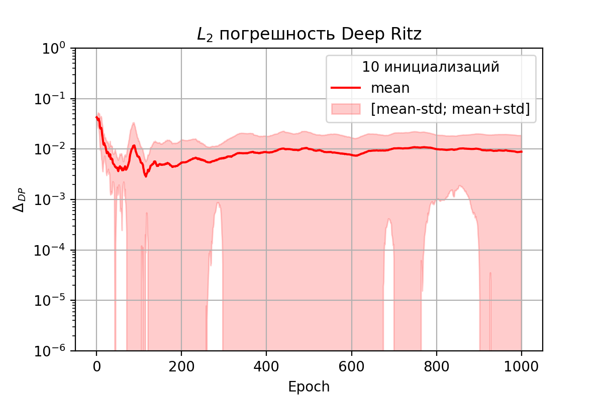

# Общая Информация
## Структура репозитория:
- папка notebooks содержит пример рабочего ноутбука, использовавшегося для обучения нейронной сети и минимизации энергии;
- папка examples содержит десять примеров инициализации моделей и их работы;
- папка pics содержит иллюстрации, в частности графики функций потерь и погрешностей по эпохам обучения.

## Необходимые для работы библиотеки:
Для воспроизведения результатов нужно использовать библиотеки jaxopt (использовалась версия 0.8.3) и jax. D В случае Google Collab библиотека jax предустановлена и из коробки работает с видеокартой. В случае Yandex DataSphere библиотека также предустановлена, но для работы с видеокартой нужно установить ее отдельно (см. https://jax.readthedocs.io/en/latest/installation.html и notebooks/JAX_bloch_wall_nn.ipynb). \

Для сохранения результатов использовалась библиотека numpy

## Теоретический базис
В задачах микромагнетизма при минимизации энергии возникают проблемы с необходимостью задавать подробную вычислительную сетку. Один из способов избежать слишком большого количества степеней свободы - машинное обучение, а именно обучение искусственной нейронной сети с целью аппроксимировать искомую функцию, на которой реализуется минимум энергии.

Данный репозиторий касается только одного случая минимизации энергии - случая одномерной доменной стенки Блоха. Для такой структуры функционал энергии задается следующим образом:

$$F[\theta] = \int\limits_{-L}^{L} \left(\left(\frac{\partial \theta}{\partial x}\right)^2 + \sin^2(\theta)\right) dx,$$

где $\theta(x)$ - угол, задающий положение намагниченности в доменной стенке. Такой интеграл можно напрямую минимизировать с помощью обучения нейронной сети - такой метод называется **Deep Ritz**. От минимизации интеграла в соответствии с уравнениями Эйлера-Лагранжа можно перейти к решению дифференциального уравнения с дифференциальным оператором $\mathscr{L}$:

$$\mathscr{L} \theta = \frac{\partial^2 \theta}{\partial x^2} - \sin(\theta)\cos(\theta) = 0$$

Такой метод, использующий нейронную сеть как аппроксиматор,  в литературе получил название **physics informed neural network (PINN)**.

Известное решение, реализующее минимум функционала энергии и обращающее уравнение в тождество, имеет вид

$$\theta_{true} = 2\arctan(\exp(x)).$$

 ## Методология

 Для аппроксимации функции $\theta(x)$ мы используем полносвязную нейронную сеть (всего 391 параметр) с механизмом skip connection:

  

Здесь входными данными являются координаты узлов вычислительной сетки (2001 узел равномерной сетки).
Последним блоком на рисунке отмечено значение искомой функции в кокретном узле вычислительной сетки, а предпоследним - слой, который обеспечивает выполнение граничных условий на сегменте $[-L; L]$

$$\theta(-L) = \theta_{true}(-L) \approx 0, \quad \theta(L) = \theta_{true}(L) \approx \pi $$

$$\frac{\partial \theta}{\partial x}\Bigr|_{-L} = \frac{\partial \theta _{true}}{\partial x}\Bigr| _{-L} \approx 0$$

$$\frac{\partial \theta}{\partial x}\Bigr|_{L} = \frac{\partial \theta _{true}}{\partial x}\Bigr| _{L} \approx 0.$$

Граничные условия для функции $\theta_{nn}$, аппоксимируемой нейронной сетью, реализованы с помощью функции Рвачёва $\omega_R:$

$$\displaystyle \omega_R(x) = \frac{1}{1+\alpha(x)} \left(2L - \sqrt{(x+L)^2 + (L-x)^2 - 2\alpha(x)(x+L)(L-x)}\right),$$ 

$$\alpha(x) = 0.9,$$

$$\theta_{nn}(x) = g(x) + \omega_R(x) v(x) - \omega_R(x) \frac{\partial \omega_R(x)}{\partial x} \frac{\partial g(x)}{\partial x} + \omega_R(x)^2 \theta_{prev}(x),$$
где $g(x), v(x)$ - функции вида $ax+b$, задающие граничные условия Дирихле и Неймана соответственно.

Качество аппоксимации оцениловалось по метрике $L_2$-погрешности:

$$\Delta = \displaystyle\sqrt{\int_{-L}^{L} (\theta_{nn}(x) - \theta_{true}(x))^2 \, dx}.$$

Для обучения использовлась библиотека JAX и оптимизатор LBFGS из библиотеки jaxopt (https://jaxopt.github.io/stable/index.html).

## Результаты
Результаты приведены для 10 реализаций обучения с различной начальной инициализацией параметров нейронной сети. По этим реализациям было проведено усреднение и найдено стандартное отклонение.

### Функции потерь
Для начала приведем значения функций потерь по эпохам для каждого из методов:

  
  

Видно, что вне зависимости от начальной инициализации параметров функции потерь сходятся за 1000 эпох обучения к одному и тому же значению с малым стандартным отклонением.

### Решения
Каждый метод к концу обучения на качественном уровне даёт решение, близкое к аналитическому:

  
  

Однако, в ходе обучения обнаруживается, что каждый из методов сдвигает участок решения с максимальной производной влево или вправо. Это иллюстрирует рисунок $L_2$-погрешности и сдвига координаты значения $\pi/2$ решения относительно координаты значения $\pi/2$ аналитического решения:

  

Отсюда видно, что на величину $L_2$-погрешности сильное влияние оказывает сдвиг решения, вносимый нейронной сетью. 

### Погрешности
Вносимые сдвиги решения приводят к тому, что $L_2$-погрешность по 10 реализациям имеет высокое стандартное отклонение и среднее значение, превышающее $10^{-3}$:

  
  

Но из того, что функции потерь по ходу обучения монотонно убывают следует, что каждый из методов не различает вносимых сдвигов. Для того, чтобы учесть эту особенность в оценке погрешности, была введена скорректированная оценка погрешности:

$$\Delta^s = \displaystyle\sqrt{\int_{-L}^{L} (\theta_{nn}(x) - \theta_{true}(x-\delta))^2 \, dx},$$
где $\delta$ - оцененная по значению $\pi/2$ величина сдвига решения, аппроксимируемого нейронной сетью.

  
  

Из рисунков видно, что средняя по 10 реализациям скорректированная $L_2$-погрешность монотонно падает и на плато имеет порядок $10^{-3}$, совпадающий с минимальной достижимой ошибкой известной из литературы.

## Выводы
На примере одномерной домененной стенки Блоха было показано, что:
- Подходы Deep Ritz и PINN c равным успехом могут быть применены для минимизации
			энергии в задачах микромагнетизма;
- На сетке (2001 узел) НС с 391 параметром позволяет аппроксимировать решение с погрешностью (скорректированной) $10^{-3}$ (совпадает с известным значением);
- Решение по ходу обучения сдвигается относительно аналитического, что не позволяет однозначно оценивать погрешность.
